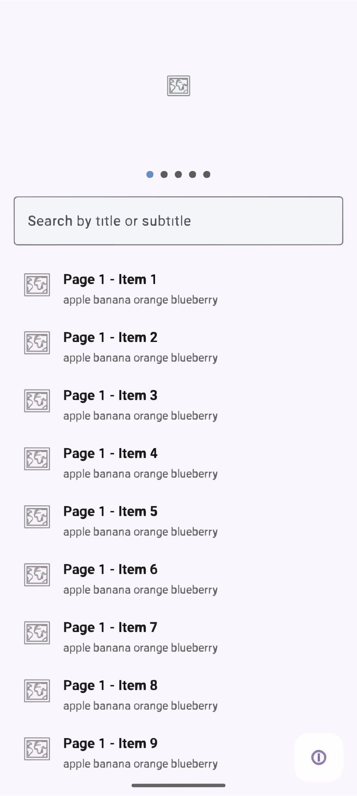

# ABCBankCarousel

Android demo app for a banking client: image carousel, scrollable filtered list, and statistics bottom sheet. The UI is implemented twice—**XML (View)** and **Jetpack Compose**—on separate branches for comparison.

- **JDK 17**
- **minSdk 24**, **targetSdk 35**

## Project structure

- **Clean Architecture + MVVM**
  - **Domain:** `domain/model/`, `domain/usecase/` (no Android dependencies)
  - **Presentation:** shared `ABCMainViewModel`; UI differs by branch (XML vs Compose)
  - **No data layer** (in-memory mock data)
- **Package:** `com.abcbank.carousel`

## Branches

| Branch | UI stack | Launcher activity      |
|--------|----------|------------------------|
| `main` | — | None (foundation only) |
| `feature/xml-implementation` | View + ViewPager2 + RecyclerView + ViewBinding | `ABCMainActivity`      |
| `feature/compose-implementation` | Compose (HorizontalPager, LazyColumn, state hoisting) | `ComposeMainActivity`  |

Each UI branch has its own launcher activity; sync with Gradle and run the app from the branch you have checked out.

## What the app does (both branches)

- **Image carousel** — Swipe to change page; list and page indicators follow the current page.
- **Scrollable list** — Different item counts per page (25, 30, 20, 15, 28). Each item has a thumbnail, title, and subtitle (e.g. fruit names).
- **Search** — Pinned at top; filters by title or subtitle (case-insensitive, real-time).
- **FAB** — Opens a bottom sheet with stats for all pages: page label, item count, and top 3 character counts.

## Implementation notes

- **State:** ViewModel exposes `StateFlow`; Compose uses `collectAsStateWithLifecycle()` and hoisted state/callbacks.
- **Lifecycle:** ViewModel has no activity/fragment references; XML clears binding in `onDestroyView`; coroutines use `viewModelScope`.
- **Lists:** RecyclerView with `DiffUtil` (XML); LazyColumn with stable `key` (Compose).
- **Tests:** Unit tests for `FilterItemsUseCase` in `app/src/test/`.